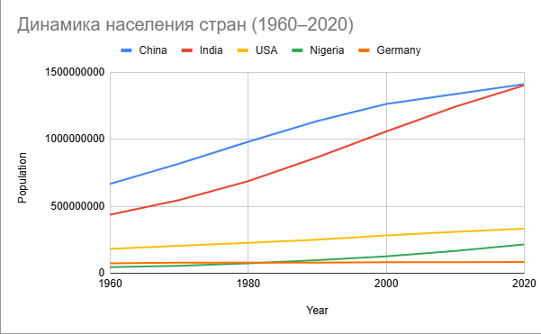
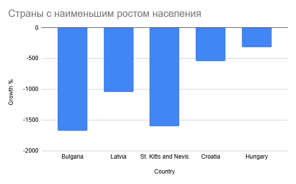
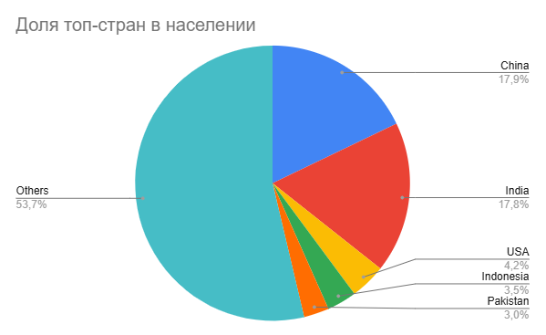
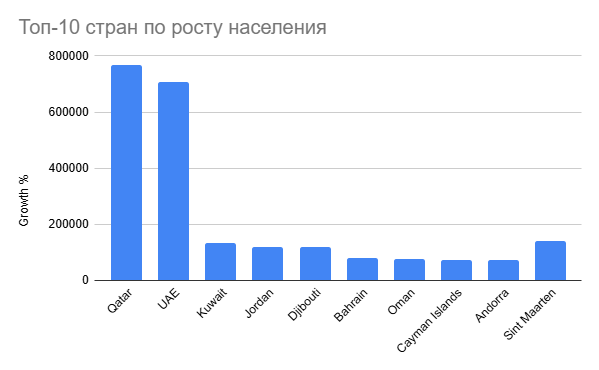

# Глобальные демографические тренды: анализ роста и распределения населения стран мира

## Синопсис

Данный проект посвящен анализу динамики роста населения стран мира за период с 1960 по 2020 годы. На основе открытых данных Всемирного банка проводится исследование глобальных демографических изменений, выявляются ключевые тенденции и различия между странами.

В рамках проекта были рассчитаны показатели роста населения, проведено сравнение стран и регионов, а также построены визуализации, позволяющие наглядно продемонстрировать демографические процессы в мире.

---

## Актуальность

Рост населения является одним из ключевых факторов, влияющих на экономическое развитие, урбанизацию, рынок труда и экологическую ситуацию в мире.  

Современные демографические процессы крайне неравномерны: в одних странах наблюдается быстрый рост населения, в других — стагнация или даже сокращение. Понимание этих различий важно для прогнозирования будущего развития стран и регионов, а также для принятия управленческих решений.

---

## Исследовательские вопросы

В рамках проекта были рассмотрены следующие вопросы:

- Как изменилось население стран мира с 1960 по 2020 год?
- Какие страны демонстрируют наибольший и наименьший рост населения?
- Какие регионы мира являются основными драйверами демографического роста?
- Существуют ли страны с отрицательной динамикой населения?
- Как распределено население между странами мира?

---

## Данные

В проекте использовались открытые данные Всемирного банка (World Bank):

- Показатель: **Population, total**
- Период: 1960–2020 годы
- Уровень: страны мира

### Обработка данных:
- удалены агрегированные регионы (например, "World", "Europe & Central Asia")
- оставлены только отдельные страны
- рассчитан показатель роста населения (%)
- выделены группы стран (Large / Medium / Small)
- сформированы выборки:
  - топ-10 по населению
  - топ-10 по росту
  - страны с минимальным ростом

Данные доступны в папке:  
`data`

---

## Анализ

Проведенный анализ позволил выявить ряд ключевых закономерностей:

### 🔹 1. Неравномерность роста населения
Рост населения в мире распределен крайне неравномерно: одни страны демонстрируют экспоненциальный рост, в то время как другие — стагнацию или снижение.

### 🔹 2. Влияние миграции и экономики
Страны с максимальным ростом (например, страны Персидского залива) показывают аномально высокие значения, что объясняется не естественным приростом, а миграцией и экономическим развитием.

### 🔹 3. Демографический рост в Африке
Африканские страны являются основными драйверами роста населения в мире, демонстрируя одни из самых высоких темпов.

### 🔹 4. Снижение населения в Европе
Ряд европейских стран показывает отрицательную динамику, что связано с низкой рождаемостью и эмиграцией.

---

### Визуализации

В проекте были построены следующие графики:

- Динамика роста населения крупнейших стран
  
- Топ стран по темпам роста населения
  
- Страны с наименьшим ростом населения
  
- Распределение населения между странами
  

Все визуализации доступны в папке:  
`visualization`

---

## Референсы

- World Bank Open Data: https://data.worldbank.org  
- United Nations Population Division  
- Our World in Data (https://ourworldindata.org)  

---

## Инструменты

В ходе выполнения проекта были использованы следующие инструменты:

- **Google Таблицы** — обработка данных и построение графиков  
- **Microsoft Excel** — расчет показателей  
- **GitHub** — хранение проекта и документации  
- **Markdown** — оформление README.md  

---
